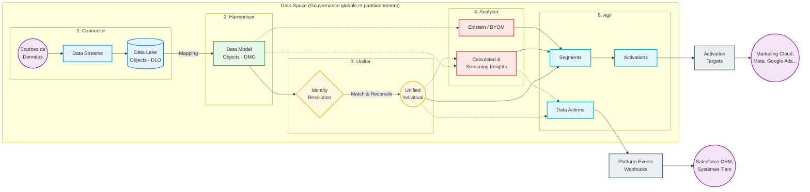

# DATA-CLOUD  (GEMINI 3)

L'écosystème Salesforce a beaucoup évolué ces dernières années, et il est vrai que la terminologie peut parfois sembler un peu dense.

En tant qu'expert, je vais vous démystifier **Salesforce Customer 360** et **Salesforce Data Cloud**, car bien qu'ils soient intimement liés, ils représentent deux concepts distincts : la *vision* et le *moteur*.

Voici une présentation claire et structurée de ces solutions.

---

### 1. Salesforce Customer 360 : La Vision

**Customer 360** n'est pas un produit unique que vous pouvez acheter et installer. C'est le nom donné à **l'ensemble du portefeuille de produits Salesforce** (Sales Cloud, Service Cloud, Marketing Cloud, Commerce Cloud, etc.) lorsqu'ils fonctionnent ensemble.

* **L'objectif :** Briser les silos entre vos départements.
* **Le concept :** Créer une "vue unique du client". Si un client appelle le service client parce que son colis est en retard, l'équipe commerciale et l'équipe marketing doivent le savoir instantanément pour éviter de lui envoyer un e-mail promotionnel inapproprié au même moment.

### 2. Salesforce Data Cloud : Le Moteur (Anciennement Genie / CDP)

Si Customer 360 est la voiture, **Data Cloud** est son moteur surpuissant. C'est la plateforme de données client (CDP - Customer Data Platform) hyperscale et en temps réel de Salesforce.

Historiquement, les données vivaient dans des bases séparées. Data Cloud résout ce problème en ingérant des volumes massifs de données (structurées et non structurées) provenant de *n'importe où* et en les rendant exploitables *en temps réel* par les applications Salesforce.

### 3. Comment fonctionne Data Cloud ? (Les 5 piliers)

Pour bien comprendre la puissance de Data Cloud, il faut regarder son cycle de traitement des données :

* **🔗 1. Connecter (Ingestion) :** Data Cloud se connecte à toutes vos sources de données. Cela inclut vos applications Salesforce, mais aussi des sources externes via des connecteurs natifs (Amazon Sagemaker, Snowflake, Google BigQuery, sites web, applications mobiles, systèmes ERP legacy).
* **🧩 2. Harmoniser (Modélisation) :** Toutes ces données arrivent dans des formats différents. Data Cloud les mappe vers un modèle de données standardisé (le *Customer Information Model*), pour qu'elles parlent toutes le même langage.
* **👤 3. Unifier (Résolution d'identité) :** C'est la magie du système. Il relie les points entre "l'adresse IP 123", "l'adresse e-mail jean.dupont@email.com" et "le profil Twitter @JeanD", pour créer un **Profil Client Unifié**.
* **🧠 4. Analyser et Prédire :** Une fois le profil unifié, l'intelligence artificielle de Salesforce (Einstein) entre en jeu. Elle peut calculer la valeur à vie du client (CLV), prédire le risque de désabonnement (churn), ou recommander la prochaine meilleure action (Next Best Action).
* **🚀 5. Agir (Activation) :** Les données ne servent à rien si elles ne sont pas actionnables. Vous pouvez envoyer ces profils ou des segments d'audience vers Marketing Cloud pour une campagne ciblée, vers Service Cloud pour alerter un agent, ou vers Tableau pour du reporting avancé.

---

### 4. La valeur ajoutée pour l'entreprise

Pourquoi les entreprises investissent-elles massivement dans Data Cloud pour réaliser leur Customer 360 ?

> **L'hyper-personnalisation en temps réel :** Vous ne réagissez plus à ce que le client a fait hier, mais à ce qu'il est en train de faire *maintenant* sur votre site web.
> **La réduction des coûts d'intégration :** Le "Zero Copy" avec des partenaires comme Snowflake ou Google Cloud permet de lire les données là où elles se trouvent, sans avoir à les déplacer ou à les dupliquer coûteusement.
> **Une IA plus intelligente :** L'intelligence artificielle n'est aussi bonne que les données qu'elle consomme. En nourrissant Salesforce Einstein (ou votre propre IA) avec des données harmonisées et unifiées, vos prédictions deviennent redoutables d'efficacité.

---

Souhaitez-vous que nous explorions **un cas d'usage spécifique** pour illustrer cela (par exemple, comment le Marketing et le Service Client collaborent grâce à Data Cloud) ou préférez-vous aborder **les aspects plus techniques de l'intégration des données** ?

---

Voici une illustration qui représente visuellement la relation entre Salesforce Data Cloud (le moteur) et la vision Customer 360, en y intégrant des éléments extérieurs pour montrer le flux de données et son impact dans le monde réel.

[Image: Une infographie futuriste illustrant Salesforce Data Cloud et Customer 360. À gauche, un cerveau numérique étiqueté "SALESFORCE DATA CLOUD" ingère des données provenant de diverses sources externes comme des satellites ("EXTERNAL DATA"), des serveurs ("LEGACY SYSTEMS"), des téléphones ("MOBILE & SOCIAL") et des flux e-commerce. À l'intérieur, les données sont harmonisées en un "HARMONIZED CUSTOMER PROFILE". Un flux d'énergie relie ce cerveau à un cercle central étiqueté "CUSTOMER 360", où les différentes applications Salesforce (Sales, Service, Marketing, Commerce Cloud) entourent un profil client unique. De ce cercle, des actions sont projetées dans une ville futuriste en arrière-plan : une publicité personnalisée sur un panneau, un drone de livraison, une voiture connectée, et un agent de service utilisant un tableau de bord unifié.]

J'ai conçu cette image pour qu'elle soit à la fois claire sur le plan conceptuel et visuellement riche :

* **Data Cloud comme "cerveau" :** Il est au centre, collectant et traitant intelligemment les données brutes pour créer un profil harmonisé.
* **Sources externes variées :** Des éléments comme le satellite ou les serveurs hérités montrent que Data Cloud connecte *tout*, pas seulement les données Salesforce.
* **Customer 360 comme résultat :** Le cercle unifié montre comment cette intelligence est distribuée à toutes les équipes (Ventes, Service, etc.) pour une vue cohérente.
* **Impact dans le monde réel :** La ville en arrière-plan illustre les résultats concrets : des offres personnalisées, des services proactifs et des expériences connectées pour le client final.

---

Voici les éléments constitutifs principaux (les "building blocks") de Salesforce Data Cloud.

Pour bien les comprendre, il est préférable de les classer selon le cycle de vie de la donnée dans la plateforme. J'ai inclus la terminologie en anglais (qui est souvent la norme sur l'interface Salesforce) accompagnée de sa signification en français.

### 1. Organisation et Gouvernance

* **Data Spaces (Espaces de données) :** C'est l'élément que vous avez cité. Il permet de partitionner logiquement vos données, vos métadonnées et vos processus à l'intérieur d'une même instance Data Cloud. C'est indispensable pour séparer les données par marque, par région géographique ou par filiale, afin de respecter la confidentialité et la gouvernance.

### 2. Ingestion des données (Connecter)

* **Data Streams (Flux de données) :** Ce sont les tuyaux d'entrée. Un flux de données connecte une source externe (Salesforce CRM, Marketing Cloud, Amazon S3, Google Cloud Storage, SDK Web/Mobile, API) à Data Cloud pour y déverser les données.
* **Data Lake Objects / DLO (Objets du lac de données) :** C'est la donnée à l'état brut. Lorsqu'un *Data Stream* ingère des données, elles atterrissent dans Data Cloud sous forme de DLO, exactement dans le même format que la source d'origine.

### 3. Modélisation (Harmoniser)

* **Data Model Objects / DMO (Objets du modèle de données) :** C'est l'étape de standardisation. On prend les données brutes (*DLO*) et on les "mappe" (associe) à un modèle de données standard fourni par Salesforce (le *Customer 360 Data Model*). Par exemple, un "Client" du CRM et un "Acheteur" du site e-commerce deviennent tous deux le DMO standard "Individual" (Individu).

### 4. Résolution d'identité (Unifier)

* **Identity Resolution (Règles de résolution d'identité) :** C'est le moteur de déduplication et de fusion. Il se base sur deux sous-éléments :
* **Match Rules (Règles de correspondance) :** Les critères pour dire que deux profils sont la même personne (ex: "Correspondance exacte sur l'email" OU "Même nom + Même numéro de téléphone").
* **Reconciliation Rules (Règles de réconciliation) :** En cas de conflit, quelle donnée garde-t-on ? (ex: "Prendre le numéro de téléphone le plus récent" ou "Garder l'adresse email issue du CRM en priorité").

* **Unified Individual (Profil Unifié) :** C'est le résultat direct de l'Identity Resolution. C'est le fameux "Golden Record" ou profil client 360.

### 5. Intelligence et Calculs (Analyser)

* **Calculated Insights (Connaissances calculées) :** Ce sont des métriques multidimensionnelles calculées sur vos données. Au lieu de faire un simple filtre, vous créez des scores ou des agrégats (ex: calcul du CA total par client, valeur à vie du client (CLTV), score de RFM - Récence, Fréquence, Montant).
* **Streaming Insights (Connaissances en continu) :** Des calculs similaires, mais exécutés en temps quasi-réel sur des flux de données entrants (ex: détecter si un utilisateur clique 3 fois sur la page "Abonnement" dans les 10 dernières minutes).

### 6. Actionnabilité (Agir)

* **Segments :** L'interface de création d'audiences. Vous utilisez le *Profil Unifié* et les *Calculated Insights* pour filtrer votre base (ex: "Femmes de 25-35 ans, vivant à Paris, avec une CLTV > 1000€ et qui ont ouvert un ticket SAV le mois dernier").
* **Activation Targets (Cibles d'activation) :** La destination où vous allez envoyer votre *Segment*. Cela peut être Salesforce Marketing Cloud, Meta (Facebook Ads), Google Ads, Amazon S3, etc.
* **Activations :** Le pont entre le *Segment* et la *Cible d'activation*. C'est ici que l'on choisit quelles données précises on envoie (ex: on n'envoie que l'email haché et le prénom à Facebook).
* **Data Actions (Actions sur les données) :** Un outil d'automatisation qui écoute ce qui se passe dans Data Cloud et déclenche un événement dans Salesforce CRM (via les *Platform Events*) ou via un webhook (ex: si un profil atteint le statut "Risque de désabonnement", on crée automatiquement une tâche pour le commercial dans Sales Cloud).

*Optionnel mais essentiel pour les profils très techniques :*

* **Einstein Studio (BYOM - Bring Your Own Model) :** Permet aux data scientists de connecter leurs propres modèles de Machine Learning (hébergés sur Databricks, Snowflake, SageMaker...) directement aux données de Data Cloud pour faire des prédictions (ex: score de propension d'achat).

---

Un diagramme est en effet le meilleur moyen de visualiser comment tous ces "blocs de construction" interagissent pour transformer une donnée brute en une action concrète.

Voici le schéma de l'architecture et du cycle de vie de la donnée dans Salesforce Data Cloud, représenté via Mermaid :

### Comment lire ce diagramme :

1. **Le Cadre Global (Data Space) :** Tout se passe à l'intérieur d'un *Data Space*, qui garantit que ces données sont cloisonnées selon vos règles de gouvernance (par exemple : "Espace Europe" vs "Espace US").
2. **Le Flux Principal (Lignes pleines) :** Vous voyez le parcours classique de la donnée de gauche à droite. La source externe alimente le **Data Stream**, qui stocke la donnée brute dans le **DLO**. Celle-ci est traduite dans le langage standard Salesforce (**DMO**).
3. **La Magie de l'Unification :** Le DMO passe dans l'entonnoir de l'**Identity Resolution** pour créer le **Profil Unifié (Unified Individual)**.
4. **L'Enrichissement (Lignes pointillées) :** Les Insights et l'IA (Einstein) viennent enrichir ce profil avec des scores et des calculs.
5. **L'Action :** Enfin, les profils et les insights nourrissent les **Segments**, qui sont envoyés via les **Activations** vers des cibles externes, ou déclenchent des **Data Actions** en temps réel dans le CRM.

---

Souhaitez-vous que nous plongions dans la configuration technique d'une de ces étapes en particulier (par exemple : **comment configurer les règles de l'Identity Resolution**) ou préférez-vous aborder **les stratégies de segmentation** à partir du profil unifié ?

---

C'est un excellent choix de sujet. L'**Identity Resolution** (Résolution d'Identité) est véritablement le cœur du réacteur de Data Cloud. C'est ici que la magie opère pour transformer des dizaines d'enregistrements fragmentés en un seul "Golden Record".

Pour configurer cela, Data Cloud utilise ce qu'on appelle un **Ruleset** (Ensemble de règles). Ce Ruleset se divise en deux grandes étapes : décider *qui est qui* (Match Rules), puis décider *quelle information garder* en cas de doublon (Reconciliation Rules).

Voici comment configurer ces règles, étape par étape, comme un architecte de données.

---

### 1. Créer le Ruleset (L'Ensemble de règles)

La première étape consiste à créer l'enveloppe qui va contenir vos règles.

* Vous naviguez dans l'onglet **Identity Resolutions** de Data Cloud et cliquez sur **New**.
* Vous choisissez l'entité principale que vous souhaitez unifier. Dans 99 % des cas, il s'agit de l'entité standard **Individual** (le DMO qui représente une personne physique).

### 2. Configurer les "Match Rules" (Règles de Correspondance)

L'objectif ici est de répondre à la question : **À quelles conditions deux enregistrements différents (ex: un contact CRM et un compte e-commerce) appartiennent-ils à la même personne ?**

Vous allez créer des conditions (qui fonctionnent avec des "OU" logiques). Dès qu'une condition est remplie, Data Cloud fusionne les profils.

Vous disposez de trois méthodes de correspondance pour vos critères :

* **Exact (Exact) :** Les données doivent être strictement identiques. (ex: `Email Exact` = jean.dupont@email.com).
* **Normalized (Normalisé) :** Data Cloud "nettoie" la donnée avant de comparer. Très utile pour les numéros de téléphone (ex: +33612345678 est considéré identique à 06 12 34 56 78) ou les adresses email (jean.dupont@email.com = Jean.Dupont@Email.com).
* **Fuzzy (Flou) :** Utilise un algorithme de similarité pour repérer les fautes de frappe ou les variations. (ex: "Jean-Baptiste" et "J. Baptiste", ou "Dupont" et "Dupon").

> **Exemple d'une bonne stratégie de Match Rules :**
> * **Règle 1 :** `Party Identification Exact` (Si l'ID du client externe est le même, c'est la même personne).
> * *OU* **Règle 2 :** `Email Normalized` ET `First Name Exact`.
> * *OU* **Règle 3 :** `Phone Normalized` ET `Last Name Fuzzy`.
> 
> 

### 3. Configurer les "Reconciliation Rules" (Règles de Réconciliation)

Maintenant que Data Cloud sait que "Jean Dupont" (du CRM) et "Jeannot D." (du site web) sont la même personne, une nouvelle question se pose : **Quel prénom doit-on afficher sur le Profil Unifié final ?**

C'est le rôle des règles de réconciliation. Vous les configurez champ par champ (ou pour tous les champs d'un coup). Vous avez trois logiques au choix :

* **Source Sequence (Priorité de la source) :** C'est la méthode la plus utilisée. Vous classez vos systèmes du plus fiable au moins fiable.
* *Exemple :* 1. Salesforce CRM (très fiable), 2. Service Cloud, 3. Inscription Web (déclaratif, moins fiable). Si le CRM contient un prénom, c'est lui qui gagne. Sinon, on regarde le système 2, etc.

* **Most Frequent (Le plus fréquent) :** Data Cloud choisit la valeur qui apparaît le plus souvent dans toutes vos sources de données.
* *Exemple :* Si 3 systèmes disent "Jean" et 1 système dit "Jeannot", "Jean" l'emporte.

* **Last Updated (Le plus récent) :** On garde la donnée la plus fraîche, peu importe le système d'où elle vient. Très utile pour l'adresse postale ou le numéro de téléphone.

### 4. Exécuter et Analyser (Consolidation Rate)

Une fois vos règles enregistrées, vous lancez le calcul (qui sera ensuite automatisé).

Data Cloud va vous fournir une métrique clé : le **Consolidation Rate (Taux de consolidation)**.

* Si vous aviez 1 million de profils sources et que vous obtenez 800 000 profils unifiés, votre taux de consolidation est de 20 %.
* *Note d'expert :* Si votre taux est de 80 %, vos règles de correspondance (Match Rules) sont probablement trop agressives (trop "Fuzzy") et vous êtes en train de fusionner des homonymes qui ne devraient pas l'être.

---

Maintenant que nous avons ce "Profil Unifié" parfait et dédoublonné, voulez-vous que nous regardions **comment créer un Segment (une audience cible)** à partir de ces données, ou préférez-vous comprendre comment créer un **Calculated Insight** (comme la Valeur à Vie du Client) pour enrichir ce profil ?

---
C'est là que tout le travail effectué en amont prend son sens ! La segmentation dans Data Cloud, c'est le moment où le profil unifié se transforme en un puissant levier d'action pour le marketing, les ventes ou le service client.

L'avantage majeur de Data Cloud, c'est que son outil de création de segments (le *Segment Builder*) est visuel. Il fonctionne par "glisser-déposer" (drag-and-drop), ce qui permet aux équipes métiers de créer des audiences complexes sans avoir à écrire une seule ligne de code SQL.

Pour tirer pleinement parti de ce Profil Unifié, voici les **4 stratégies de segmentation** (ou piliers) que vous pouvez combiner :

### 1. La Segmentation Démographique et Déclarative (Le "Qui")

C'est la base de votre ciblage. Ces données proviennent directement des attributs du *Profil Unifié* (Unified Individual).

* **Exemples de critères :** Âge, sexe, code postal, statut de fidélité, canal de communication préféré, consentement RGPD.
* **Le cas d'usage :** "Je veux cibler tous les clients membres du programme de fidélité 'Gold' qui habitent en région parisienne et qui ont accepté d'être contactés par SMS."

### 2. La Segmentation Transactionnelle (Le "Combien")

Ici, nous n'interrogeons plus seulement le profil, mais ses objets associés (les commandes). C'est là que les **Calculated Insights** (que nous avons évoqués plus tôt) entrent en jeu.

* **Exemples de critères :** Valeur à Vie du Client (CLTV), panier moyen, date du dernier achat, catégorie de produits la plus achetée.
* **Le cas d'usage :** "Je veux cibler les clients dont la CLTV est supérieure à 1 500 € (Insight calculé) ET qui n'ont rien acheté au cours des 6 derniers mois."

### 3. La Segmentation Comportementale (Le "Comment")

C'est ici que l'hyper-personnalisation commence. On utilise les données d'engagement ingérées en temps réel (via les flux web/mobile ou Marketing Cloud).

* **Exemples de critères :** Ouvertures d'e-mails, clics, visites sur une page web spécifique, ajouts au panier abandonnés, appels récents au service client.
* **Le cas d'usage :** "Je veux cibler les clients qui ont visité la page 'Nouvelle Collection Hiver' plus de 3 fois cette semaine (Streaming Insight) MAIS qui n'ont pas converti."

### 4. La Segmentation Prédictive (Le "Et demain ?")

Grâce à Salesforce Einstein (ou à vos propres modèles d'IA via *Einstein Studio*), vous ne regardez plus le passé, mais le futur.

* **Exemples de critères :** Score de risque de désabonnement (Churn risk), probabilité d'ouverture d'un e-mail, propension à acheter une catégorie de produit.
* **Le cas d'usage :** "Je veux exclure de ma campagne promotionnelle massive tous les clients ayant une 'Propension à acheter' supérieure à 90 % (car ils achèteront de toute façon, inutile de leur offrir un code promo)."

---

### 💡 La puissance des "Attributs Associés" (Related Attributes)

C'est une fonctionnalité technique mais cruciale de Data Cloud. Souvent, la donnée dont vous avez besoin ne se trouve pas sur le profil du client, mais à plusieurs niveaux de profondeur.

Data Cloud vous permet de naviguer dans le modèle de données :

> *Profil Unifié ➡️ Commande ➡️ Ligne de Commande ➡️ Produit ➡️ Catégorie de Produit.*

Vous pouvez ainsi créer une règle très fine, par exemple : *"Trouve-moi tous les profils unifiés qui ont au moins une commande, contenant au moins une ligne de commande, dont le produit appartient à la catégorie 'Chaussures de running', achetée avec une remise de plus de 20 %."*

---

C'est une excellente question, car la notion de **Data Space** (Espace de données) est souvent source de confusion. On a tendance à imaginer qu'il s'agit de bases de données physiquement séparées, ce qui n'est pas le cas.

Pour faire simple : un Data Space est une **frontière logique** (virtuelle), pas une frontière physique.

Voici exactement ce qu'il contient et où il se trouve.

---

### 1. Que contient un Data Space ? (Le contenu logique)

Imaginez Data Cloud comme un grand immeuble de bureaux appartenant à votre entreprise. Les Data Spaces sont les différents étages sécurisés de cet immeuble.

Un Data Space agit comme un mini-Data Cloud autonome. À l'intérieur d'un Data Space spécifique (par exemple, un espace nommé "Europe" ou "Marque A"), vous allez retrouver **tous les éléments constitutifs que nous avons vus précédemment, isolés des autres espaces** :

* **Ses propres flux de données (Data Streams) :** Les connexions spécifiques à cet espace.
* **Ses propres données brutes et harmonisées (DLO et DMO) :** Les données du site web européen n'iront que dans le Data Space "Europe".
* **Ses propres règles d'Identity Resolution :** Vous pouvez avoir des règles de dédoublonnage différentes selon la marque ou la région.
* **Ses propres Profils Unifiés :** Le client "Jean Dupont" dans le Data Space Europe sera distinct du client "Jean Dupont" dans le Data Space Asie.
* **Ses propres Segments et Insights :** Les marketeurs assignés à cet espace ne verront et ne pourront utiliser que les données de cet espace.

**Le but principal ? La gouvernance et la sécurité.** Cela permet de s'assurer qu'un marketeur de votre filiale française n'ait pas accès aux données clients de votre filiale américaine (crucial pour le RGPD), tout en payant et en gérant une seule instance Data Cloud globale.

---

### 2. Où est localisé le Data Space ? (La localisation physique)

Puisque le Data Space est virtuel, sa localisation physique est en réalité **la localisation de votre instance Data Cloud globale**.

* **L'infrastructure sous-jacente (Hyperforce) :** Data Cloud ne tourne pas sur les anciens serveurs historiques de Salesforce. Il est construit nativement sur **Hyperforce**, qui est l'architecture de nouvelle génération de Salesforce déployée sur le cloud public (principalement Amazon Web Services - AWS).
* **La résidence des données (Data Residency) :** Lorsque votre entreprise achète Data Cloud, l'instance est provisionnée dans une région géographique spécifique qui correspond généralement à celle de votre organisation Salesforce principale (votre CRM).
* *Exemple :* Si votre entreprise est française et a demandé un hébergement européen pour des raisons de conformité, vos données Data Cloud (et donc tous vos Data Spaces) seront physiquement stockées et traitées sur des serveurs AWS situés en Europe (par exemple à Francfort ou à Paris).

> **En résumé :** Vos Data Spaces sont cloisonnés logiquement pour vos utilisateurs, mais physiquement, ils cohabitent dans la même base de données "hyperscale" sécurisée, hébergée sur l'infrastructure cloud publique choisie par votre entreprise lors de l'achat.

---

Souhaitez-vous que nous abordions **un cas d'usage pratique justifiant la création de plusieurs Data Spaces** (par exemple, la séparation entre une activité B2B et B2C), ou préférez-vous que nous reprenions notre exploration sur **les méthodes d'Activation de vos segments** vers l'extérieur ?

---

Maintenant que vous avez créé cette audience hyper-ciblée, la prochaine étape logique est de l'utiliser.

Souhaitez-vous que nous explorions **les "Activations" (comment envoyer ce segment vers Marketing Cloud ou Facebook Ads)**, ou préférez-vous voir comment utiliser les **"Data Actions" pour alerter un commercial dans Sales Cloud en temps réel** lorsqu'un client entre dans ce segment ?

---

C'est une excellente question, car la notion de **Data Space** (Espace de données) est souvent source de confusion. On a tendance à imaginer qu'il s'agit de bases de données physiquement séparées, ce qui n'est pas le cas.

Pour faire simple : un Data Space est une **frontière logique** (virtuelle), pas une frontière physique.

Voici exactement ce qu'il contient et où il se trouve.

---

### 1. Que contient un Data Space ? (Le contenu logique)

Imaginez Data Cloud comme un grand immeuble de bureaux appartenant à votre entreprise. Les Data Spaces sont les différents étages sécurisés de cet immeuble.

Un Data Space agit comme un mini-Data Cloud autonome. À l'intérieur d'un Data Space spécifique (par exemple, un espace nommé "Europe" ou "Marque A"), vous allez retrouver **tous les éléments constitutifs que nous avons vus précédemment, isolés des autres espaces** :

* **Ses propres flux de données (Data Streams) :** Les connexions spécifiques à cet espace.
* **Ses propres données brutes et harmonisées (DLO et DMO) :** Les données du site web européen n'iront que dans le Data Space "Europe".
* **Ses propres règles d'Identity Resolution :** Vous pouvez avoir des règles de dédoublonnage différentes selon la marque ou la région.
* **Ses propres Profils Unifiés :** Le client "Jean Dupont" dans le Data Space Europe sera distinct du client "Jean Dupont" dans le Data Space Asie.
* **Ses propres Segments et Insights :** Les marketeurs assignés à cet espace ne verront et ne pourront utiliser que les données de cet espace.

**Le but principal ? La gouvernance et la sécurité.** Cela permet de s'assurer qu'un marketeur de votre filiale française n'ait pas accès aux données clients de votre filiale américaine (crucial pour le RGPD), tout en payant et en gérant une seule instance Data Cloud globale.

---

### 2. Où est localisé le Data Space ? (La localisation physique)

Puisque le Data Space est virtuel, sa localisation physique est en réalité **la localisation de votre instance Data Cloud globale**.

* **L'infrastructure sous-jacente (Hyperforce) :** Data Cloud ne tourne pas sur les anciens serveurs historiques de Salesforce. Il est construit nativement sur **Hyperforce**, qui est l'architecture de nouvelle génération de Salesforce déployée sur le cloud public (principalement Amazon Web Services - AWS).
* **La résidence des données (Data Residency) :** Lorsque votre entreprise achète Data Cloud, l'instance est provisionnée dans une région géographique spécifique qui correspond généralement à celle de votre organisation Salesforce principale (votre CRM).
* *Exemple :* Si votre entreprise est française et a demandé un hébergement européen pour des raisons de conformité, vos données Data Cloud (et donc tous vos Data Spaces) seront physiquement stockées et traitées sur des serveurs AWS situés en Europe (par exemple à Francfort ou à Paris).

> **En résumé :** Vos Data Spaces sont cloisonnés logiquement pour vos utilisateurs, mais physiquement, ils cohabitent dans la même base de données "hyperscale" sécurisée, hébergée sur l'infrastructure cloud publique choisie par votre entreprise lors de l'achat.

---

Souhaitez-vous que nous abordions **un cas d'usage pratique justifiant la création de plusieurs Data Spaces** (par exemple, la séparation entre une activité B2B et B2C), ou préférez-vous que nous reprenions notre exploration sur **les méthodes d'Activation de vos segments** vers l'extérieur ?

---

C'est le cas d'usage parfait pour illustrer l'utilité des Data Spaces ! Séparer les activités **B2B** (Business-to-Business) et **B2C** (Business-to-Consumer) est l'une des raisons les plus fréquentes pour lesquelles les architectes Salesforce mettent en place cette ségrégation logique.

Mélanger ces deux mondes dans un seul espace de travail crée souvent un chaos conceptuel et technique. Voici pourquoi, et comment les Data Spaces résolvent ce problème.

---

### 1. Le problème : Pourquoi ne pas tout mettre au même endroit ?

Les modèles de données et les comportements d'achat en B2B et B2C sont fondamentalement différents :

* **L'entité centrale n'est pas la même :** En B2C, le cœur du modèle est l'**Individu** (une personne physique). En B2B, le cœur du modèle est le **Compte** (une entreprise), auquel sont rattachés des contacts.
* **Les règles de dédoublonnage diffèrent :** En B2C, deux personnes avec la même adresse e-mail personnelle (`jean.dupont@gmail.com`) sont probablement la même personne. En B2B, deux contacts avec le même nom de domaine d'entreprise (`@acme.com`) ne sont *pas* la même personne, mais des collègues appartenant au même Compte.
* **La gouvernance :** Vos équipes marketing B2C ne doivent pas nécessairement avoir accès aux contrats confidentiels de vos grands comptes B2B, et vice versa.

### 2. La solution : Une architecture à deux Data Spaces

Dans Data Cloud, vous allez créer deux espaces distincts : **Data Space B2C** et **Data Space B2B**. Voici comment ils vont se comporter de manière autonome.

#### 🏢 Data Space 1 : "Consumer" (B2C)

* **Sources connectées :** Votre site e-commerce, votre application mobile, et les données de Service Cloud pour le support client grand public.
* **Modélisation :** Tout est centré sur le profil *Individual*.
* **Identity Resolution :** Les règles fusionnent les profils en se basant sur les numéros de téléphone portable, les e-mails personnels et les identifiants de compte e-commerce.
* **Insights calculés :** Vous calculez le Panier Moyen par client, la probabilité d'ouverture d'un e-mail promotionnel, ou le risque d'abandon de panier.

#### 🏭 Data Space 2 : "Enterprise" (B2B)

* **Sources connectées :** Sales Cloud (Pistes, Comptes, Opportunités), votre système de facturation ERP, et LinkedIn Lead Gen.
* **Modélisation :** Le focus est mis sur l'objet *Account* et ses *Contacts* associés.
* **Identity Resolution :** Les règles associent les contacts à des entreprises en se basant sur les noms de domaine des e-mails professionnels (ex: tout ce qui finit par `@entreprise.fr` va vers le même compte) ou sur le numéro de SIRET.
* **Insights calculés :** Vous calculez le Chiffre d'Affaires annuel par Compte, le délai moyen de clôture d'une opportunité, ou le score de santé global de l'entreprise.

---

### 3. Les bénéfices de cette séparation

> **Pertinence des audiences :** Quand le marketeur B2C se connecte à Data Cloud, il ne voit que des segments pertinents pour lui ("Acheteurs compulsifs", "Inactifs depuis 30 jours"). Il n'est pas pollué par des segments B2B du type "Comptes du secteur industriel".
> **Sécurité et conformité :** Le cloisonnement logique garantit qu'une erreur de ciblage ne mélangera jamais vos clients particuliers avec vos partenaires commerciaux stratégiques.
> **Performance du système :** Les moteurs de calcul (Identity Resolution et Insights) tournent plus vite car ils ne traitent que les données pertinentes pour leur contexte spécifique, sans avoir à filtrer la moitié de la base de données à chaque opération.

---

Maintenant que vos données sont parfaitement structurées, unifiées et sécurisées dans leurs espaces respectifs, nous pouvons passer à la phase d'action.

Souhaitez-vous que nous explorions **les Activations** (comment envoyer une audience B2C vers Meta/Facebook Ads) ou préférez-vous voir le fonctionnement des **Data Actions** (comment alerter un commercial B2B en temps réel dans Salesforce lorsqu'un compte clé visite votre page de tarifs) ?

---

